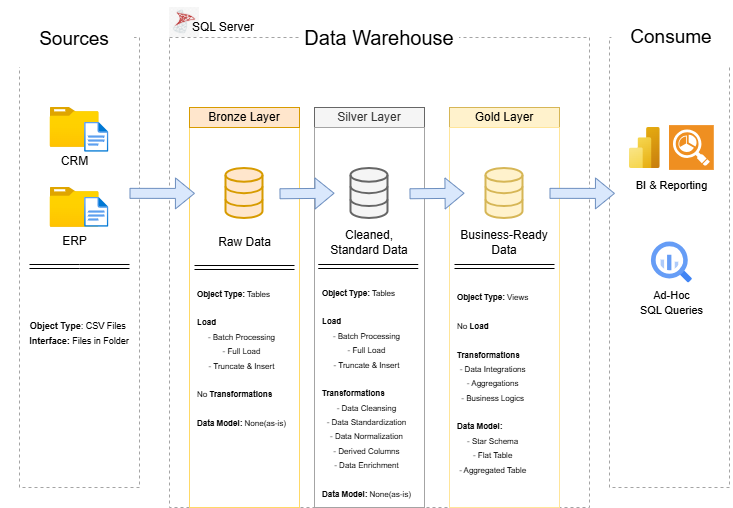

# Data Warehouse and Analytics Project

Welcome to the **Data Warehouse and Analytics Project** repository! 🚀
This project demonstrates a comprehensive data warehousing and analytics solution, from building a data warehouse to generating actionable insights. Designed as a portfolio project that highlights industry best practices in data engineering and analytics.

---

## 📖 Project Overview

This project involves:

1. **Data Architecture:** Designing the overall data warehouse architecture and layer structure.
2. **ETL Pipelines:** Extracting, transforming, and loading data from source system into the warehouse.
3. **Data Modeling:** Developing fact and dimension tables using a **star schema** for analytical queries.
4. **Analytics & Reporting:** Creating SQL-based queries and reports to generate insights from the transformed data

### Skills Demonstrated
- SQL Development
- Data Engineering
- ETL/ELT Pipelines
- Data Modeling
- Data Warehousing
- Data Analytics

---

## 🔨 Tools and Technologies
- **SQL Server Express** - Database Engine
- **SQL Server Management Studio (SSMS)** - SQL development and database management
- **Git and GitHub** - Version control and repository management
- **Draw.io** - Data architecture and data modeling diagrams

---

## 🚀 Project Requirements

### Building the Data Warehouse (Data Engineering)

### Objective
Develop a modern data warehouse using SQL Server to consolidate sales data, enabling analytical reporting and informed decision-making.

#### Specifications
- **Data Sources**: Import data from two source systems (ERP and CRM) provided as CSV files.
- **Data Quality**: Cleanse and resolve data quality issues prior to analysis.
- **Integration**: Combine both sources into a single, user-friendly data model designed for analytical queries.
- **Scope**: Focus on the latest dataset only; historization of data is not required.
- **Documentation**: Provide clear documentation of the data model to support both business stakeholders and analytics teams.

---

### 🏗️ Data Architecture

The data architecture for this project follows Medallion Architecture **Bronze**, **Silver**, and **Gold** layers:


1. **Bronze Layer:** Stores raw data as-is from the source systems. Data is ingested from CSV Files into SQL Server Database.
2. **Silver Layer:** This layer includes data cleansing, standardization, and normalization processes to prepare data for analysis.
3. **Gold Layer:** Houses business-ready data modeled into a star schema required for reporting and analytics.

---

## 📂 Repository Structure
```
data-warehouse-project/
│
├── datasets/                           # Raw datasets used for the project (ERP and CRM data)
│
├── docs/                               # Project documentation and architecture details
│   ├── etl.drawio                      # Draw.io file shows all different techniquies and methods of ETL
│   ├── data_architecture.drawio        # Draw.io file shows the project's architecture
│   ├── data_catalog.md                 # Catalog of datasets, including field descriptions and metadata
│   ├── data_flow.drawio                # Draw.io file for the data flow diagram
│   ├── data_models.drawio              # Draw.io file for data models (star schema)
│   ├── naming-conventions.md           # Consistent naming guidelines for tables, columns, and files
│
├── scripts/                            # SQL scripts for ETL and transformations
│   ├── bronze/                         # Scripts for extracting and loading raw data
│   ├── silver/                         # Scripts for cleaning and transforming data
│   ├── gold/                           # Scripts for creating analytical models
│
├── tests/                              # Test scripts and quality files
│
├── README.md                           # Project overview and instructions
├── LICENSE                             # License information for the repository
├── .gitignore                          # Files and directories to be ignored by Git
└── requirements.txt                    # Dependencies and requirements for the project
```
---

### BI: Analytics & Reporting (Data Analytics)

#### Objective
Develop SQL-based analytics to deliver detailed insights into:
- **Customer Behavior**
- **Product Performance**
- **Sales Trends**

These insights empower stakeholders with key business metrics, enabling strategic decision-making.

---

## 🛡️ License

This project is licensed under the [MIT License](LICENSE). You are free to use, modify, and share this project with proper attribution.


## About Me

Hi there! I'm **Matthew Michel**, a DPT transitioning into the world of data engineering. I'm passionate about learning how data is collected, transformed, stored, and used to solve real-world problems.

I'm using this repository to document my learning journey, share projects, and build my skills in SQL and data engineering.
